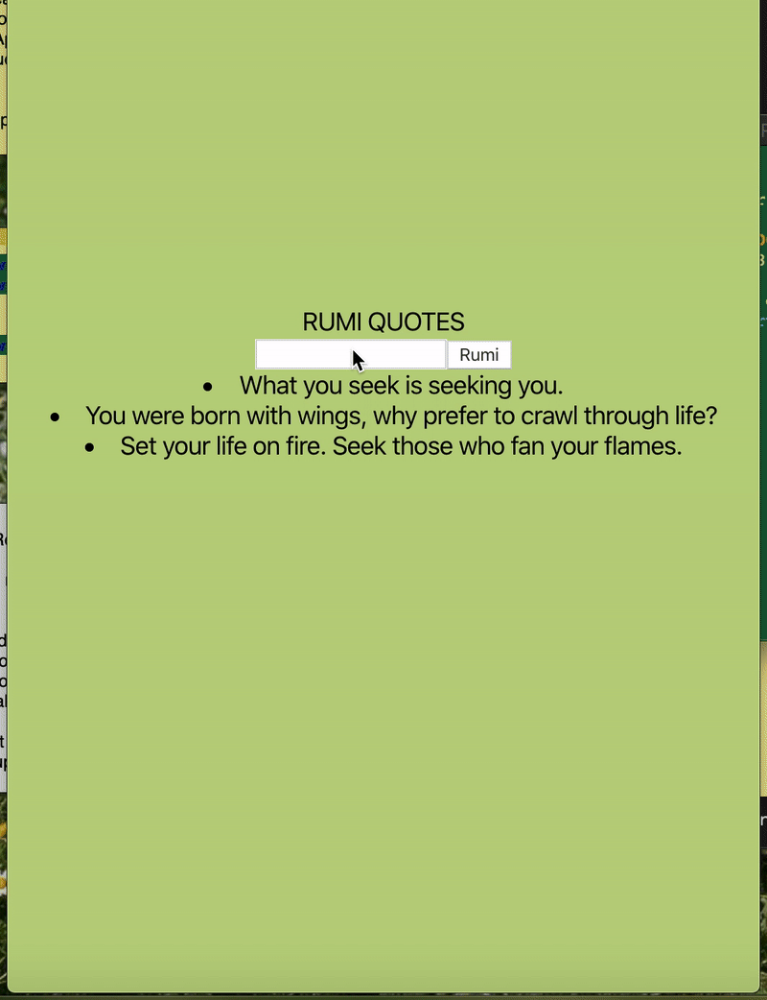

### Skeleton for making a React-Redux application 

```
npx create-react-app mantras
```
```
npm i redux react-redux 
```

### Redux

actions:
- ADD_MANTRA 
reducer:
- []

### React 

- components directory 
    - list component 
        - unordered list 
        - leave blank for now 
            - or receive and array for a prop 
    - input component 
        - class 
        - should have state for the text 
        in the input box 

### React - Redux

bridge the two parts of the application :) 

- containers direct
    - MantraListContainer
    - MantraFormContainer 
- mapStateToProps (only one needs)
- mapDispatchtoProps (only one needs)


